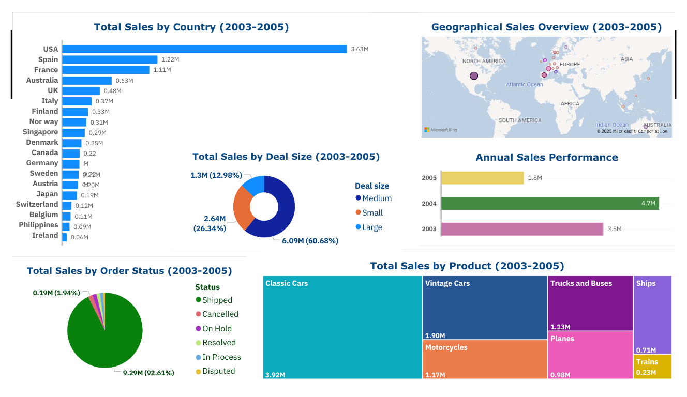

# Sales Data Analysis Project

## 📄 Overview
This project focuses on creating modular and maintainable data processing scripts for efficient data analysis and 
visualization. The structure is designed with separate modules for data loading, cleaning, and visualization. 
It analyzes a sample sales dataset from Kaggle to identify trends and provide meaningful insights. The dashboard 
presents revealing data, including total annual sales, top-selling products, bestsellers by country, a donut chart 
of deal sizes, and a pie chart of order status. Additionally, the plots display total sales analysis by MSRP, 
pricing strategy insights, and RFM analysis.

## 🗂️ Project Structure
| Directory                            | Description                                 |
|--------------------------------------|---------------------------------------------|
| `sales_data_analysis/`               | Root project directory                      |
| ├── `data/`                          | Raw and processed data files                |
| │   ├── `sales_data_sample.csv`      | Dataset CSV file                            |
| ├── `notebook/`                      | Jupyter notebooks for exploration           |
| │   ├── `sales_data_analysis.ipynb`  | Data exploration file                       |
| ├── `reports/`                       | PowerBI report files, HTML files, images    |                                     |
| ├── `src/`                           | Source code for data processing             |
| │   ├── `__init__.py`                | Initialize the src package                  |                         |
| │   ├── `data_cleaning.py`           | Data loading and cleaning functions         |
| │   ├── `data_logging.py`            | Logging configuration file                  |                                     |
| │   ├── `data_visualization.py`      | Data visualization functions                |
| │   └── `main.py`                    | Main script orchestrating tasks             |
| ├── `tests/`                         | Unit tests                                  |
| │   ├── `__init__.py`                | Initialize the tests package                | 
| │   ├── `mock_data.py`               | Mock data for unit test purposes            |
| │   ├── `test_data_cleaning.py`      | Unit tests for data cleaning functions      |
| │   ├── `test_data_visualization.py` | Unit tests for data visualization functions |
| ├── `LICENSE`                        | License information                         |
| └── `README.md`                      | Project documentation                       |

## 📊 Data source
[Sample Sales Data](https://www.kaggle.com/datasets/kyanyoga/sample-sales-data/data) is a dataset provided by Kaggle.

## ✅ Outcomes
- Data Cleaning: 
   - Dropped unnecessary columns 
   - Handled missing values 
   - Removed duplicates
   - Corrected data types
   - Fixed inconsistencies
  
- Data Transformation:
   - Added new columns
   - Changed formats
   - Grouped data
  
- Visualization (Created plots for):
   - Sales distribution by region
   - Monthly sales performance
   - Top-selling products
   - Sales distribution by MSRP
   - Quantity ordered analysis
   - Pricing strategy
   - Average deal size
   - RFM analysis

## Power BI dashboard




## 🚀 How to Get Started
**1. Clone the Repository**
   ```bash
   git clone https://github.com/ViktoriiaViktoriia/sales_data_analysis.git
   cd sales_data_analysis
   ```
**2. Install Dependencies**
   ```bash
   pip install pandas
   pip install plotly
   pip install pytest
   pip install matplotlib
   pip install pycountry
   ```
**3. Run the Main Script**
   ```bash
   python -m src.main
   ```

## 🧪 Tests
Run unit tests with:
   ```bash
   pytest tests/
   ```
## 🤝 Contributions
Your feedback and contributions are welcome! Submit issues or pull requests to collaborate.

## License 
- **Code**: Licensed under the [Apache License 2.0](LICENSE)
- **Data**: Licensed under [CC0 1.0 Public Domain Dedication](LICENSE-DATA.txt)